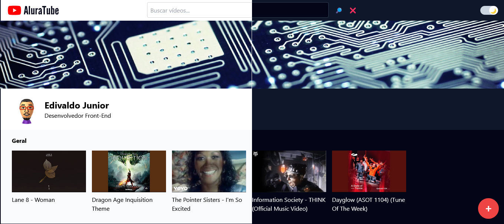
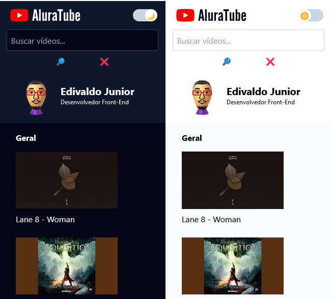

<h2>Aluratube v2</h2>

Um projeto que simula um app do Youtube registrando o título e url de qualquer vídeo que podem ser adicionados à página principal.

O app possui total responsividade para dispositivos mobile / tablets / desktop / monitores com resoluções altas, incluindo também o botão "modo noturno" deixando a página mais confortável visualmente.

<strong>Link do projeto:</strong> <a href="https://aluratube-v2.vercel.app/" target="_blank" >https://aluratube-v2.vercel.app/</a>

<h3>Modo Desktop</h3>

  

 

<h3>Modo Mobile</h3>

  

<h3>Tecnologias Utilizadas</h3>

-  [JavaScript](https://developer.mozilla.org/en-US/docs/Web/JavaScript) – Languages
-  [Autoprefixer](https://github.com/postcss/autoprefixer) – CSS Pre-processors / Extensions
-  [PostCSS](https://github.com/postcss/postcss) – CSS Pre-processors / Extensions
-  [React](https://reactjs.org/) – Javascript UI Libraries
-  [Tailwind CSS](https://tailwindcss.com) – Front-End Frameworks
-  [ESLint](http://eslint.org/) – Code Review
-  [Vite](https://vitejs.dev/) – JS Build Tools / JS Task Runners
-  [Airtable](https://airtable.com) – Spreadsheets as a Backend
-  [axios](https://github.com/mzabriskie/axios) – Javascript Utilities & Libraries

Para ver todas as tecnologias [clique aqui](/techstack.md)

<h3>Status do Deploy</h3>

<h3>Tempo Estudando o projeto</h3>

  

<h4><b>Status do projeto:</b> ✅ Concluído</h4>
